# [AlphaStrat](https://alphastrat.vercel.app/)

A personal finance web app for portfolio analysis, market research, and options analytics.

Built with Next.js 16, React 19, Supabase, and Tailwind CSS v4.

> **Access-controlled** — signup requires an invite code.

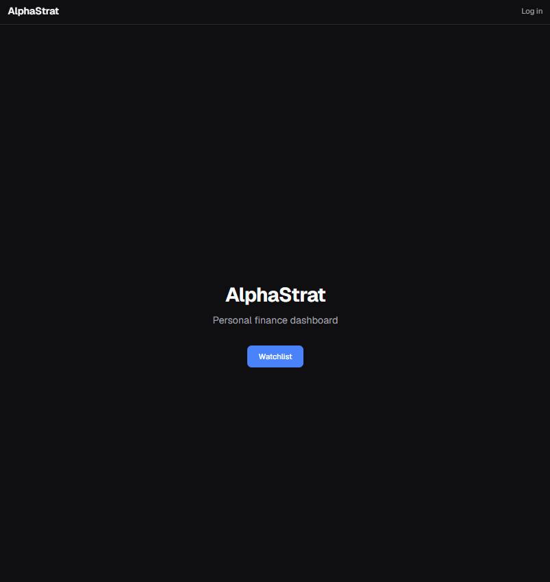

---

## Watchlist

Track tickers with real-time quotes, upcoming earnings, analyst ratings, and price targets. Click any row to open the detail panel.

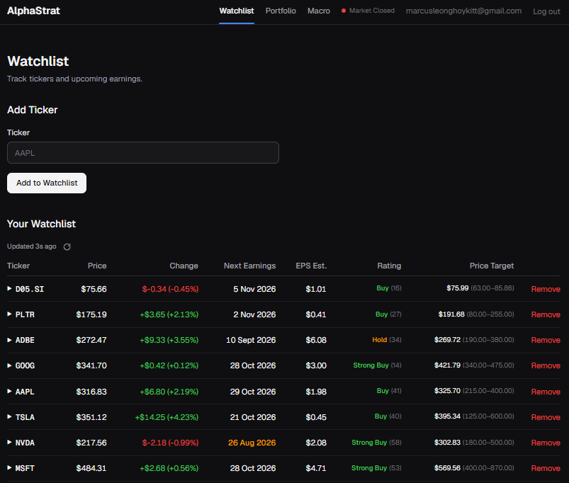

### Ticker Detail Tabs

<table>
  <tr>
    <td width="50%">
      <strong>Overview</strong><br>
      Analyst consensus gauge, next earnings date, EPS/revenue estimates, and market cap.
      <br><br>
      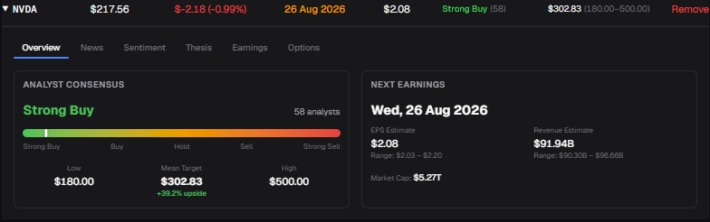
    </td>
    <td width="50%">
      <strong>News</strong><br>
      AI-summarized news grouped into themes with source attribution (Groq + Llama 3).
      <br><br>
      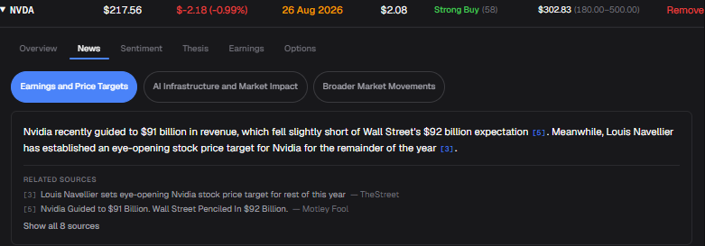
    </td>
  </tr>
  <tr>
    <td width="50%">
      <strong>Sentiment</strong><br>
      Analyst recommendation trend, Reddit &amp; Twitter/X social buzz via Adanos, and AI trend explanation.
      <br><br>
      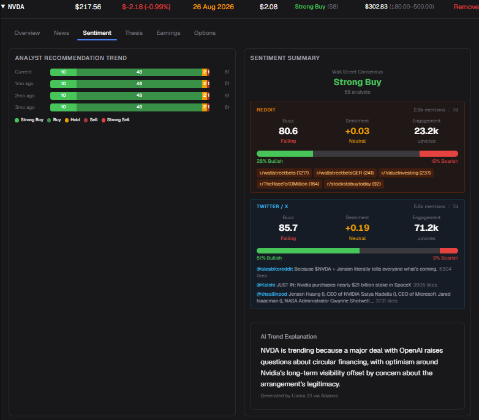
    </td>
    <td width="50%">
      <strong>Thesis</strong><br>
      AI-generated investment thesis with key metrics, rating gauge, and expandable bull/bear/base cases (Gemini Flash Lite).
      <br><br>
      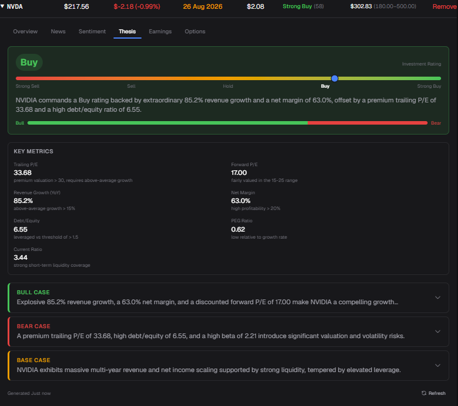
    </td>
  </tr>
  <tr>
    <td width="50%">
      <strong>Earnings</strong><br>
      Next earnings date, EPS beat/miss history, and revenue &amp; net income trend charts.
      <br><br>
      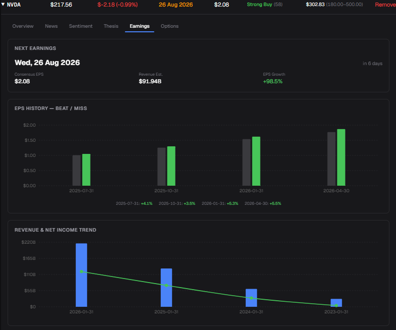
    </td>
    <td width="50%">
      <strong>Options — AI Analysis</strong><br>
      AI narrative covering market positioning, expected move, volatility, notable flow, risks, and takeaway.
      <br><br>
      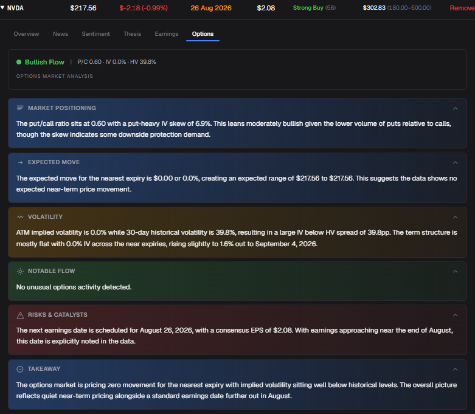
    </td>
  </tr>
</table>

### Options Charts

Expected move gauge with max pain, IV surface by moneyness, IV term structure, positioning by strike, and Greeks — all computed via Black-Scholes.

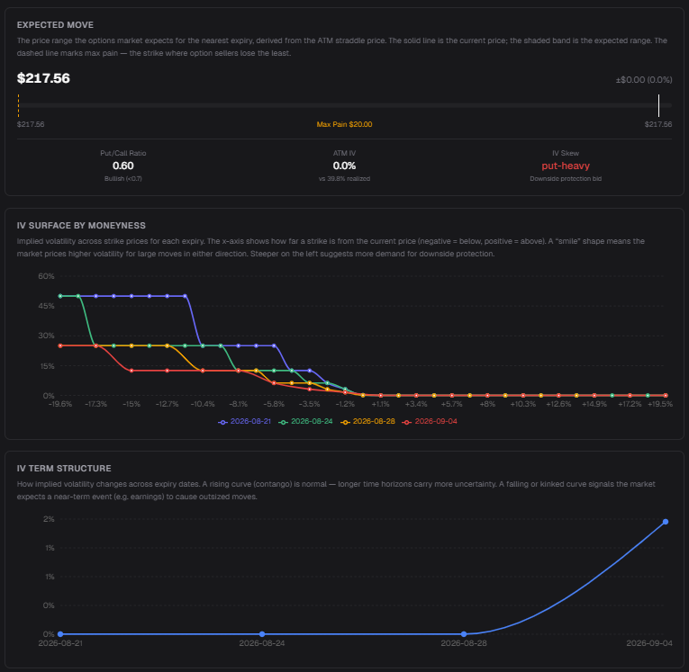

### Earnings Calendar

Upcoming earnings across your watchlist, grouped by date with EPS/revenue estimates and ranges.

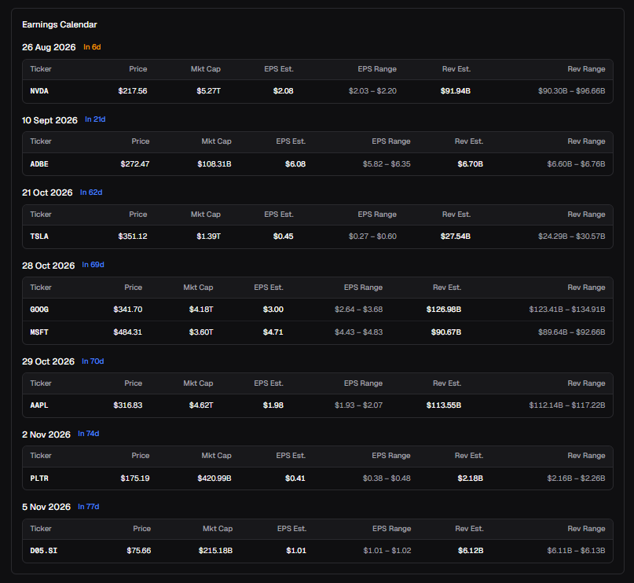

---

## Portfolio

Track positions with blended cost basis, P&L, and a performance chart benchmarked against SPY. Risk metrics include beta, Sharpe ratio, and max drawdown.

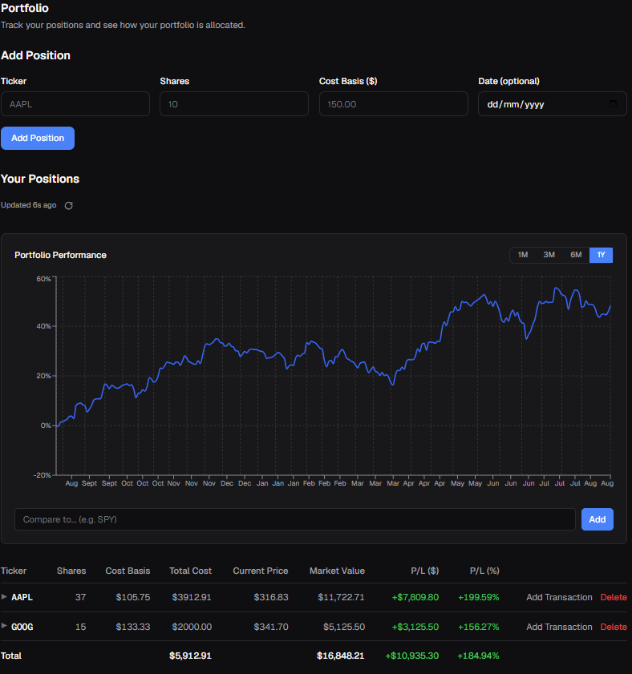

---

## Macro Dashboard

Cross-market news across Fed policy, geopolitics, commodities, jobs, and government. AI-synthesized outlook with sentiment badge and driver chips. Market mood bar and sector sentiment from social data.

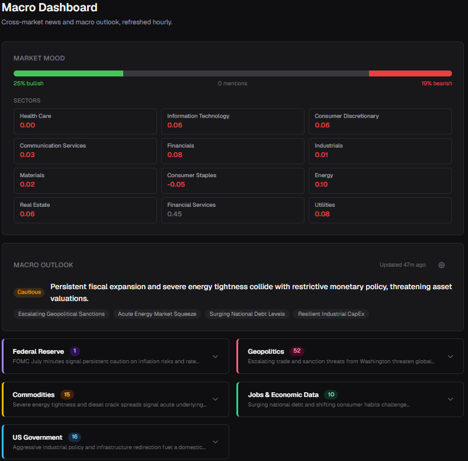

---

## Tech Stack

| Layer | Technology |
|-------|-----------|
| Framework | Next.js 16.3 (App Router) |
| UI | React 19, Tailwind CSS v4, Recharts |
| Auth | Supabase Auth (email/password, `@supabase/ssr`) |
| Database | Supabase Postgres with Row-Level Security |
| AI | Groq (Llama 3 — summaries, sentiment), Gemini Flash Lite (thesis, options, macro) |
| Market Data | Yahoo Finance REST (v8/v10), Adanos API (social sentiment) |
| Deployment | Vercel (free tier) |
| Caching | Supabase-backed generic cache with per-type TTLs |

---

## Architecture

- **No Python, no heavy SDKs** — all data fetching via direct `fetch()` calls to REST APIs
- **Generic cache utility** — `getOrFetch<T>()` with composite upsert, user-scoped or shared cache modes
- **Pure financial calculations** — unit-tested functions for P&L, risk metrics, Black-Scholes, allocation
- **Design token system** — CSS custom properties for consistent theming across all pages
- **Server Actions** for mutations, **API Routes** for data fetching
- **Proxy-based auth** (Next.js 16 `proxy.ts`) for session refresh and route protection

---

## Getting Started

### Prerequisites

- Node.js 18+
- A Supabase project
- API keys for: Groq, Gemini, Adanos (optional)

### Setup

```bash
git clone https://github.com/MarcusLeongHK/alphastrat.git
cd alphastrat
npm install
```

Create a `.env` file:

```env
NEXT_PUBLIC_SUPABASE_URL=your_supabase_url
NEXT_PUBLIC_SUPABASE_ANON_KEY=your_anon_key
GROQ_API_KEY=your_groq_key
GEMINI_API_KEY=your_gemini_key
ADANOS_API_KEY=your_adanos_key
```

Apply database migrations in order via the Supabase SQL editor or CLI (`supabase/migrations/`).

### Commands

| Command | Description |
|---------|-------------|
| `npm run dev` | Start dev server |
| `npm run build` | Production build |
| `npm run lint` | ESLint |
| `npx vitest` | Run tests |

---

## Project Structure

```
app/
  watchlist/                  # Watchlist + ticker detail panel
    tabs/                     # Overview, News, Sentiment, Thesis, Earnings, Options
  portfolio/                  # Portfolio dashboard
  macro/                      # Macro news dashboard
  guide/options/              # Options analytics guide
  components/                 # Shared UI (Header, MobileNav, Card, Badge, etc.)
  api/                        # API routes (market data, analysis, watchlist, macro)
lib/
  finance/                    # P&L, risk, allocation, Black-Scholes
  market/                     # Yahoo Finance, Adanos, RSS fetchers
  ai/                         # Thesis, news summary, options analysis, macro summary
  cache/                      # Generic cache utility
supabase/
  migrations/                 # SQL migration files
```

---

## License

Private project. All rights reserved.
